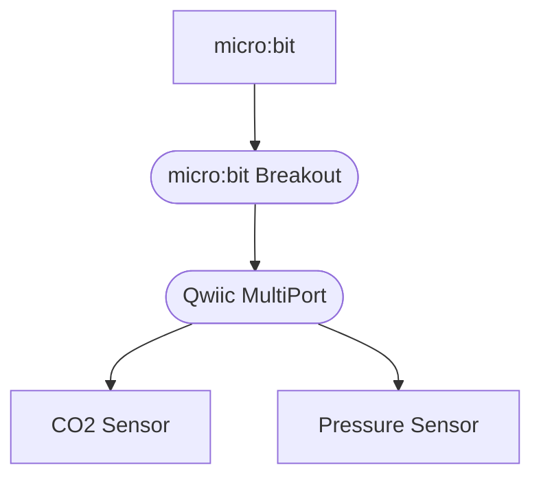

# RustyMicrobit: Moxi

An air quality sensor based on the excellent [video series](https://www.youtube.com/watch?v=vT4-bvHCbE0) by [The Rust Bits](https://patreon.com/TheRustyBits?utm_medium=clipboard_copy&utm_source=copyLink&utm_campaign=creatorshare_fan&utm_content=join_link) ([YouTube](https://www.youtube.com/@therustybits), [GitHub](https://github.com/therustybits)).

## Components

- Main board: [micro:bit v2](https://www.sparkfun.com/micro-bit-v2-board.html)
- CO2 Sensor: [SCD40](https://www.sparkfun.com/sparkfun-co-humidity-and-temperature-sensor-scd40-qwiic.html) or [SCD41](https://www.sparkfun.com/sparkfun-co-humidity-and-temperature-sensor-scd41-qwiic.html)
- Pressure Sensor: [BMP581](https://www.sparkfun.com/sparkfun-pressure-sensor-bmp581-qwiic.html)

- Connectors
  - [micro:bit Breakout](https://www.sparkfun.com/sparkfun-qwiic-micro-bit-breakout-with-headers.html)
  - [Qwiic MultiPort](https://www.sparkfun.com/sparkfun-qwiic-multiport.html)
  - [Qwiic Cables](https://www.sparkfun.com/catalogsearch/result/?q=qwiic+cables)

## Layout

