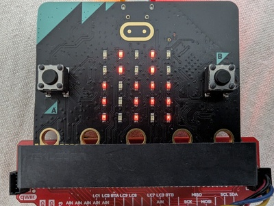

# RustyMicrobit: Moxi

An air quality sensor based on the excellent [video series](https://www.youtube.com/watch?v=vT4-bvHCbE0) by [The Rust Bits](https://patreon.com/TheRustyBits?utm_medium=clipboard_copy&utm_source=copyLink&utm_campaign=creatorshare_fan&utm_content=join_link) ([YouTube](https://www.youtube.com/@therustybits), [GitHub](https://github.com/therustybits)).

We use the micro:bit's LED display to encode the current temperature,
humidity, and CO2 levels. The exact reading for each is shown on-demand
via the microbit's buttons (A, B, and capacitive logo).

The CO2 sensor provides temperature and relative humidity readings while
compensating for atmospheric pressure.

## Display

  

Read column-by-column from left to right:

- Temperature
  - Starting from the bottom, each LED represents 10 degrees F,
  - \{50, 60, 70, 80, 90\}
- Temperature
  - Starting from the top, each LED represents 2 degrees F
  - \{1, 3, 4, 5, 7, 9\}
- CO2
  - Starting from the bottom, each LED represents 200 ppm CO2
  - \{400, 600, 800, 1000, 1200\}
- CO2
  - Starting from the top, each LED represents 40 ppm CO2 but starting at 0
  - \{0, 40, 80, 120, 160\}
    - Interpreted as \{20, 60, 100, 140, 180\} +/- 20
- Humidity
  - Starting from the bottom, each LED represents 20% relative humidity except for the
    final LED indicating a relative humidity above 90%
    - A prospective particulate sensor cautions against use when the relative humidity is above 90%
  - \{20, 40, 60, 80, 90\}
    - Interpreted as \{30, 50, 70\} +/- 10, over 80, over 90

Therefore, the display reads 73F, 960 ppm CO2, 60% relative humidity

## Hardware

Components

- Main board: [micro:bit v2](https://www.sparkfun.com/micro-bit-v2-board.html)
- CO2 Sensor: [SCD40](https://www.sparkfun.com/sparkfun-co-humidity-and-temperature-sensor-scd40-qwiic.html) or [SCD41](https://www.sparkfun.com/sparkfun-co-humidity-and-temperature-sensor-scd41-qwiic.html)
- Pressure Sensor: [BMP581](https://www.sparkfun.com/sparkfun-pressure-sensor-bmp581-qwiic.html)

Connectors

- [micro:bit Breakout](https://www.sparkfun.com/sparkfun-qwiic-micro-bit-breakout-with-headers.html)
- [Qwiic MultiPort](https://www.sparkfun.com/sparkfun-qwiic-multiport.html)
- [Qwiic Cables](https://www.sparkfun.com/catalogsearch/result/?q=qwiic+cables)

## Layout

